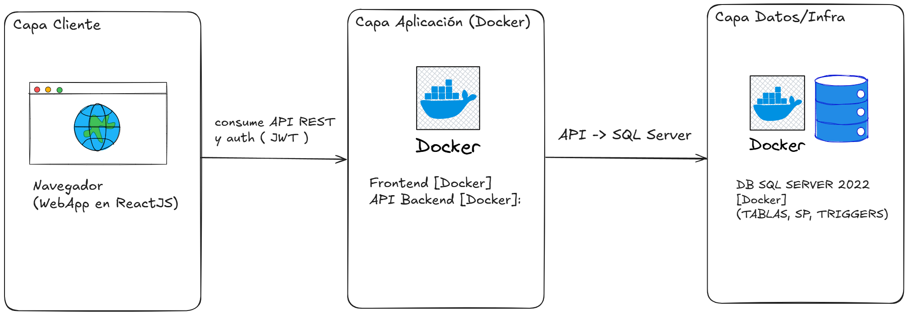
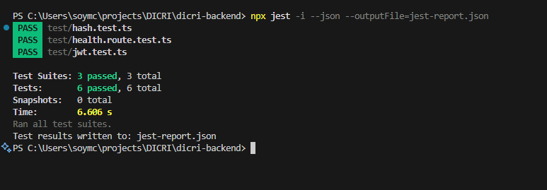

# Monorepo: Frontend, Backend e Infraestructura

Este repositorio contiene:

- Frontend (React + TypeScript)
- Backend (Node.js + TypeScript)
- Infraestructura (Docker, docker-compose)

Índice

- Arquitectura
- Frontend
- Backend
- Infraestructura
- Configuración local
- Variables de entorno
- Scripts
- Pruebas y Calidad
- Observabilidad
- Seguridad

## Arquitectura




### Explicación de la Arquitectura

El diagrama presenta una arquitectura de **tres capas** para una aplicación web moderna, utilizando **Docker** para la contenerización de los servicios.

1. **Capa Cliente:** 
   * **Función:** La interfaz de usuario con la que el usuario interactúa.
   * **Tecnología:** Una aplicación web (Frontend) desarrollada con **ReactJS** que se ejecuta en el navegador del usuario.
2. **Capa Aplicación:**
   * **Función:** El "cerebro" de la aplicación, donde reside la lógica de negocio.
   * **Tecnología:** Contiene dos servicios, el **Frontend** y la **API Backend** , ambos empaquetados en **Docker** . El cliente se comunica con la API Backend a través de llamadas **API REST** , con autenticación mediante **JWT** .
3. **Capa Datos/Infraestructura:**
   * **Función:** Almacena y gestiona los datos de la aplicación.
   * **Tecnología:** Una base de datos **SQL Server 2022** , también ejecutándose en un contenedor **Docker** . La API Backend se conecta a esta base de datos para interactuar con las tablas, procedimientos almacenados (`SP`) y triggers.

## Frontend

- Stack: React + TypeScript.
- Estructura modular por features para escalabilidad.
- Estado global en `src/store` y estado local con hooks.

## Backend

- Stack: Node.js + TypeScript (Express/Nest).
- Repositorios abstrayendo el acceso a datos. ORM sugerido: Prisma/TypeORM/Knex.
- Validación de entrada: Zod.
- Middlewares para CORS, rate limit, logging, auth.

Puntos clave

- `src/db` mantiene migraciones/seeds y el cliente DB.
- `src/api/routes` expone endpoints versionados (p. ej. `/api/v1`).

## Infraestructura

- docker-compose para entorno local orquestando frontend, backend y base de datos (p. ej. Postgres).
- Dockerfiles multistage para imágenes pequeñas.
- Swagger para documentación de API.

Red y puertos (ejemplo)

- Frontend: http://localhost:5173
- Backend: http://localhost:3000
- DB: localhost:1433
- Swagger: http://localhost:3000/docs/

## Configuración local

1) Clonar y preparar

- Requisitos: Node LTS, Docker, Docker Compose, pnpm/yarn/npm.
- Copiar variables:
  cp .env.example .env
  - cp dicri-frontend/.env.example dicri-frontend/.env
  - cp dicri-backend/.env.example dicri-backend/.env
  - cp dicri-infra/.env.example dicri-infrabacken/.env

2) Instalar dependencias

- Por paquete: (cd dicri-backend && npm i) y (cd dicri-frontend && npm i)

3) Levantar con Docker (recomendado)

- docker compose -f dicri-infra/docker-compose.dev.yml up --build

4) Levantar sin Docker (alternativa)
5) Levantar sin Docker (alternativa)

- Backend: (cd dicri-backend && npm run dev)
- Frontend: (cd dicri-frontend && npm run dev)
  - cp dicri-infra/.env.example dicri-infra/.env
- Base de datos local o contenedor solo para DB.

## Variables de entorno

- Frontend

  - VITE_API_URL=-
- Backend

  - DB_HOST=-
  - DB_PORT=-
  - DB_USER=-
  - DB_PASSWORD=-
  - DB_NAME=-
  - JWT_ACCESS_SECRET=-
  - JWT_REFRESH_SECRET=-
  - JWT_ACCESS_EXPIRES=-
  - JWT_REFRESH_EXPIRES=-
  - CORS_ORIGIN=-
  - SMTP_HOST=-
  - SMTP_PORT=-
  - SMTP_FROM=-
  - MINIO_ENDPOINT=-
  - MINIO_PORT=-
  - MINIO_USE_SSL=-
  - MINIO_ACCESS_KEY=-
  - MINIO_SECRET_KEY=-
  - MINIO_BUCKET=-
  - MINIO_PUBLIC_URL=-
  - CLAMAV_HOST=-
  - CLAMAV_PORT=-
  - CLAMAV_TIMEOUT_MS=-
  - CLAMAV_DISABLED=-
- Infra

  - Definidas en `docker-compose.dev.yml` y archivos `.env`.

## Scripts útiles

- Frontend
  - npm run dev / build / preview / test / lint
- Backend
  - npm run dev / build / start / test / lint
- Iniciar el proyecto:
  - docker compose -f docker-compose.dev.yml up
- Restar Api:
  - docker compose -f docker-compose.dev.yml restart api
- Correr migraciones y seeds:
  - docker compose -f docker-compose.dev.yml exec api npm run db:migrate

## Ejecutar tests

- Backend (desde la carpeta dicri-backend):

```powershell
cd dicri-backend
npx jest -i --json --outputFile=jest-report.json
```



## Pruebas y Calidad

- Unitarias backend: `test/` (Jest + ts-jest)
- Lint/Format: ESLint

## Observabilidad

- Health checks: `/health` y `/ready`.

## Seguridad

- CORS restringido por entorno.
- Rate limiting y helmet en API.
- JWT/OAuth2 para autenticación.
- Sanitización y validación de inputs.
